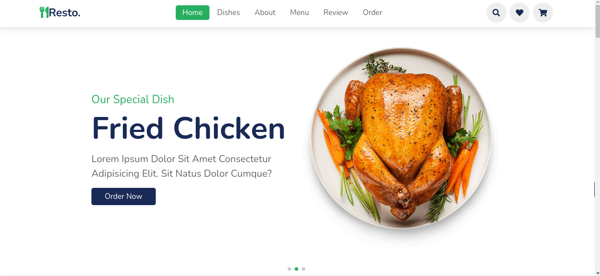
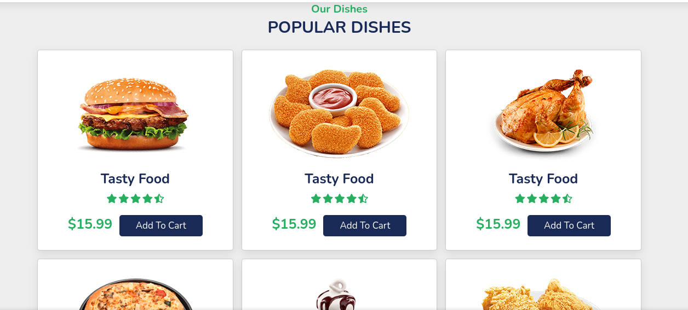
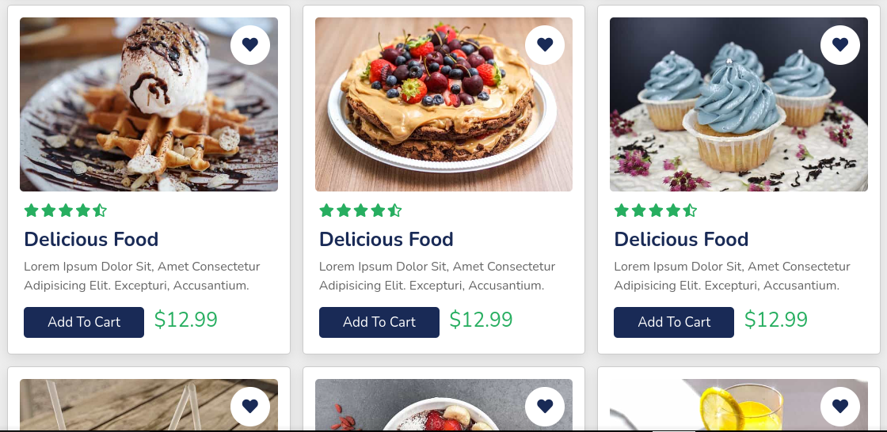
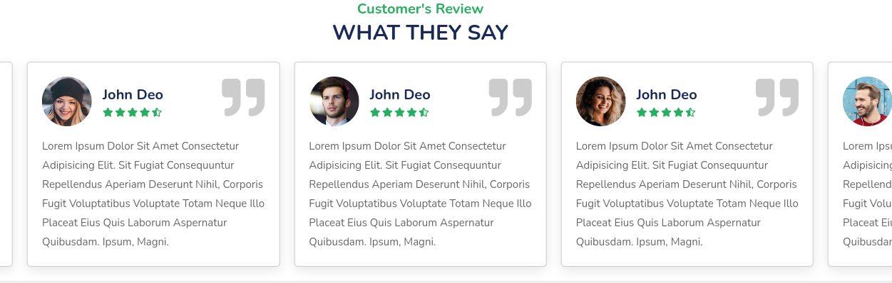

# Food-WebSite

## Objetivos del Proyecto

- Construir una App JavaScript desde cero.
- Afirmar y conectar los conceptos aprendidos en la carrera.
- Aprender mejores prácticas.
- Aprender y practicar el workflow de GIT.
- Utilizar Metodologías Ágiles.
